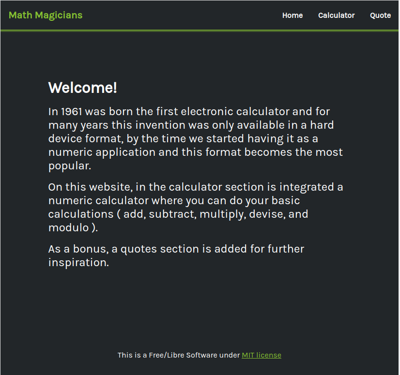
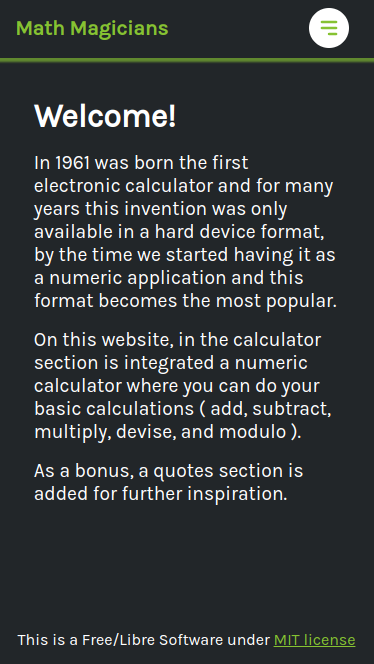

# Math Magicians

"Math magicians" is a responsive website for all fans of mathematics. It is a Single Page App (SPA) that allows users to: 
Make simple calculations. 
Read a random math-related quote.

  

Additional description about the project and its features.

## Built With

- HTML, CSS, Javascript
- React
- Vs Code

## Live Demo

[Live Demo Link](https://math-magician-mehdi-rh.netlify.app/)

## Getting Started

To get a local copy up and running follow these simple example steps.

### Prerequisites

You need nodejs and npm installed on your machine. If so, continue with the next steps.

### Setup

Install dependencies by running:

`npm install`

### Usage

Run live server by the following command:

`npm start`

### Run tests

`npm test`

### Deployment

To deploy this project run the following command:

`npm build`

and copy the content of `build` directory to the root folder of your production environment.

## Authors

👤 **Mehdi Rahal**

- GitHub: [@Mehdi-Rh](https://github.com/Mehdi-Rh)
- Twitter: [@MRahal92](https://twitter.com/MRahal92)
- LinkedIn: [mehdi-rahal22](https://www.linkedin.com/in/mehdi-rahal22/)

## 🤝 Contributing

Contributions, issues, and feature requests are welcome!

Feel free to check the [issues page](../../issues/).

## Show your support

Give a ⭐️ if you like this project!

## Acknowledgments

- Hat tip to anyone whose code was used
- Inspiration
- etc

## 📝 License

This project is [MIT](./MIT.md) licensed.
